# SWP391_SmartSchoolApp

## About Project
Applying information technology in management and teaching and learning activities in general, and facilitating students in particular, is a popular development trend of universities in Vietnam in recent years. Industry 4.0 today. Grasping that trend, our SOS team has planned to research and develop on the basis of information technology applications, to launch an electronic application platform, serving a number of basic and convenient needs. Exclusively for FPT University students. Our application development is smart school system including:

**1. Lost & Found:** The situation of lost, dropped and forgotten items of students in school is increasing day by day but we still do not have a solution to improve this problem. Based on the increase and prevalence of student loss, our team came up with the idea to develop a website called “Lost & Found” in the hope of helping students who have lost their belongings.

**2. Freelance jobs:** Understanding the job search needs of students in the school, our team found that there are currently very few job search sites dedicated to FPT students and moreover looking for freelance jobs. , short on free time. Therefore, our team developed a job search website integrated with “Lost & Found” to create a smart school system that can help students in the school get more benefits. For this purpose, our website will offer students freelance, short-term jobs selected from companies or employers everywhere.

With a leading technology school like Fpt, this promises to be a useful system developed for the common goal of building a smart and modern school.
## Team Member
- [Trịnh Ngọc Bảo](https://www.facebook.com/ngocbao159)
- [Phạm Ngọc Long](https://www.facebook.com/phamlong.19)
- [Nguyễn Văn Hải Nam](https://www.facebook.com/hainam1010)
- [Tăng Quang Khải](https://www.facebook.com/qukhaiiiiiii)

## Project User's interface:
**Welcome Page:**

### 1. Lost & Found System:
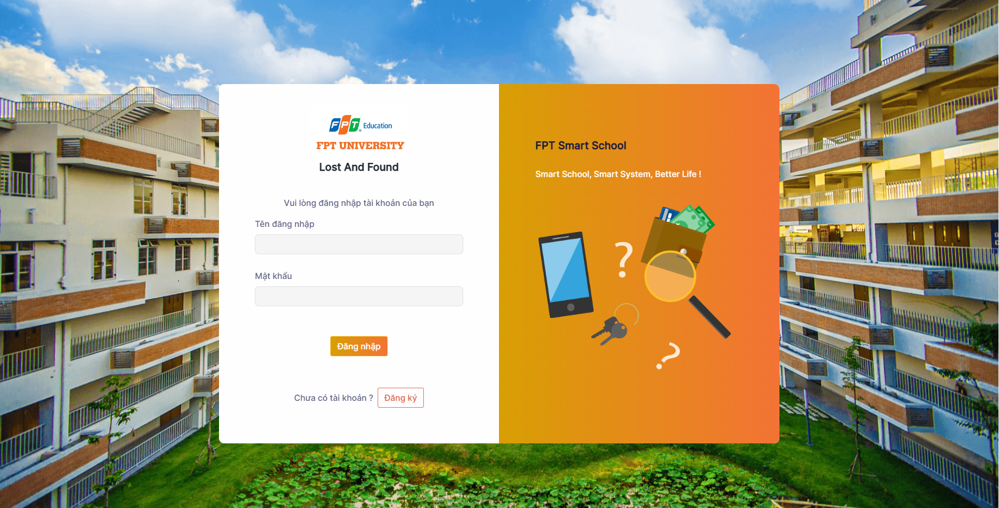

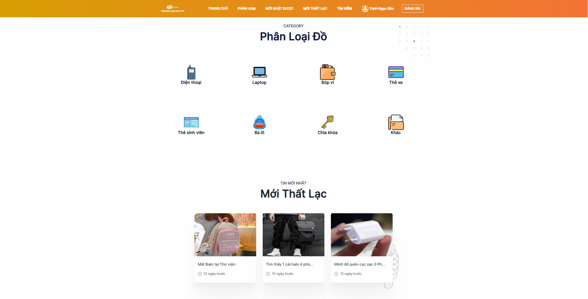

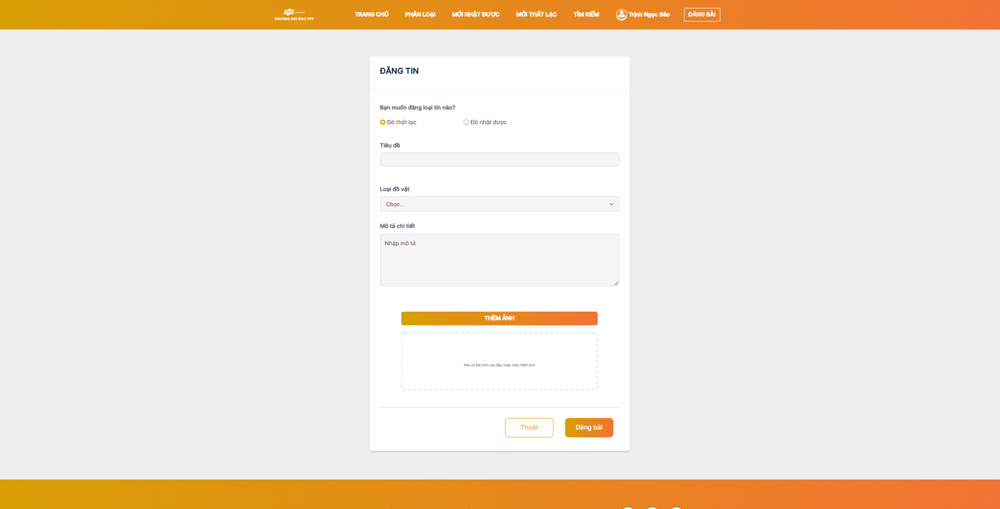

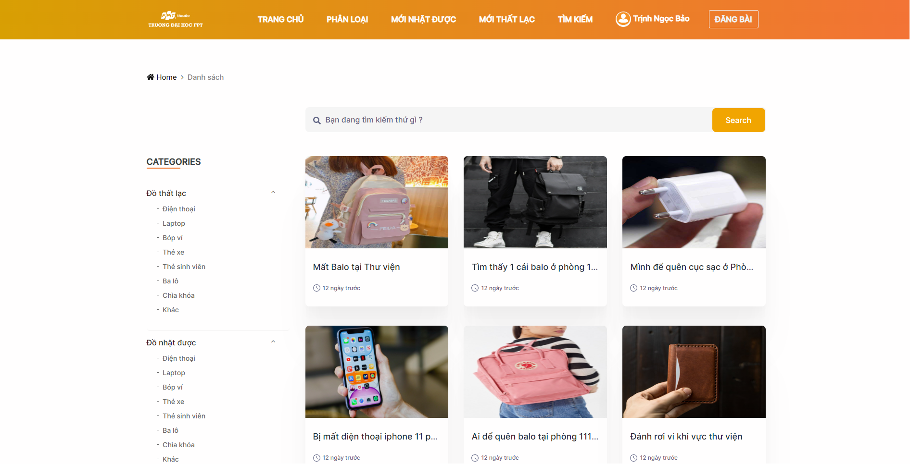

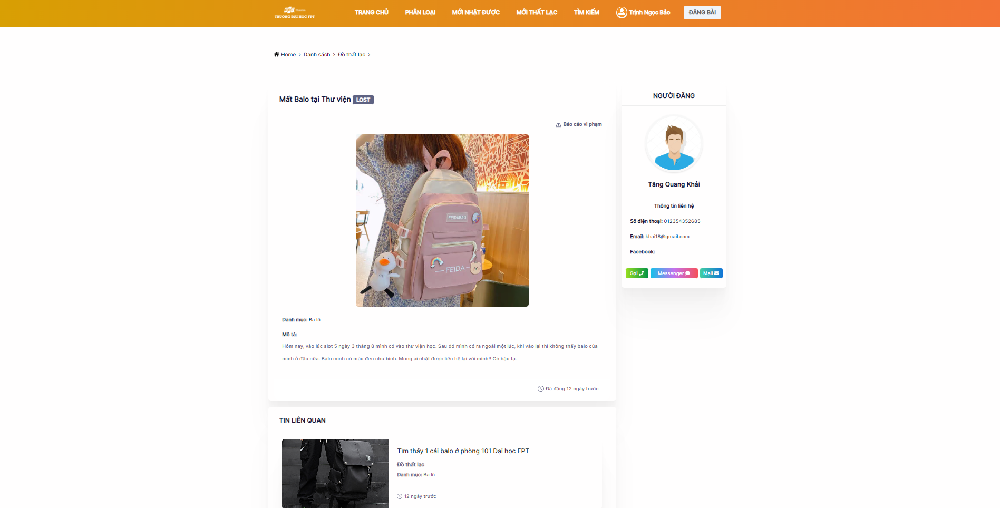

### 2. Freelance Job System:
**Freelancer Role:**

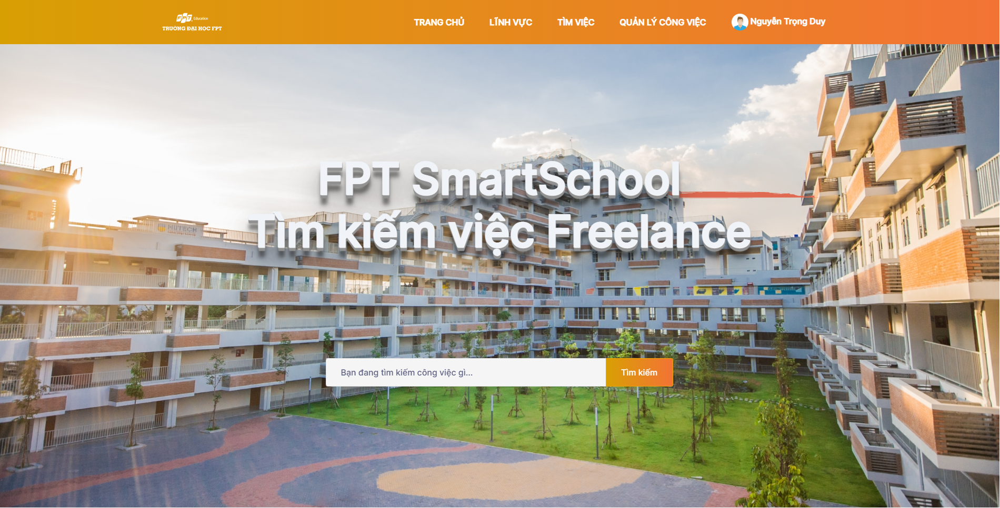

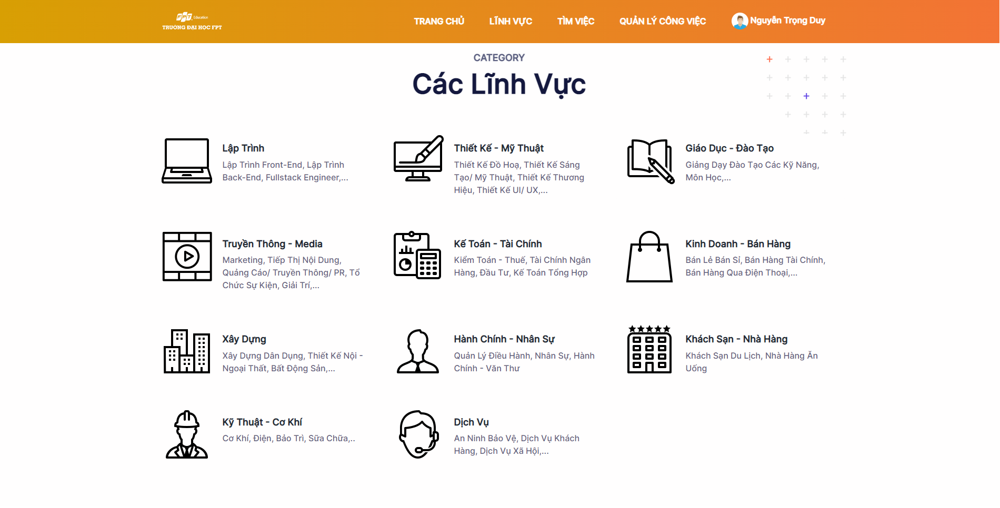

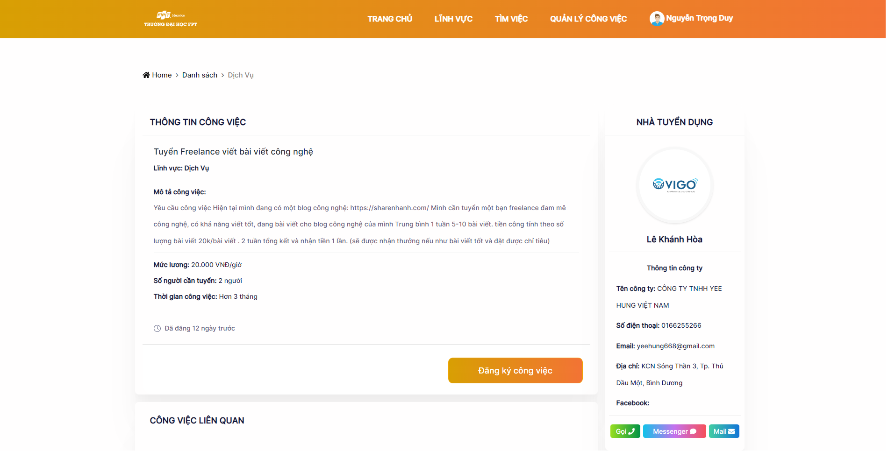

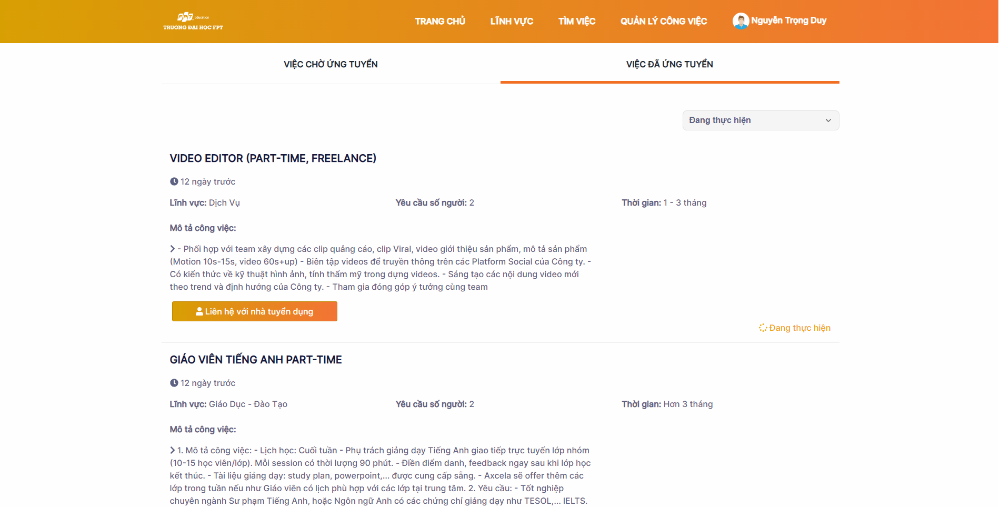

**Employer Role:**

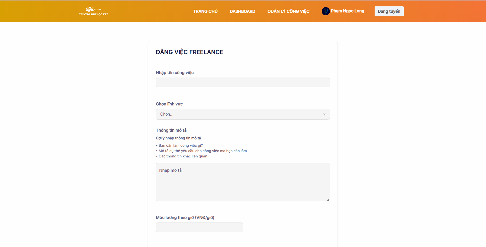

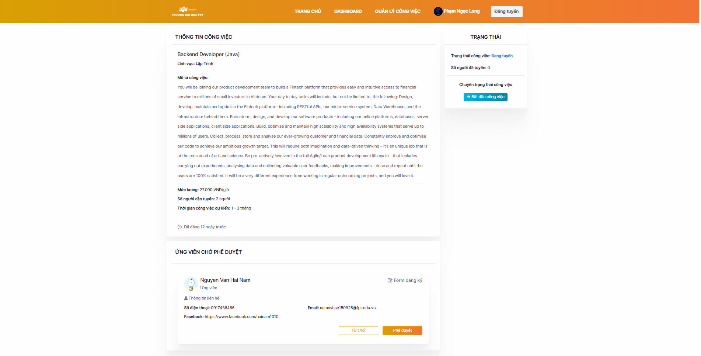

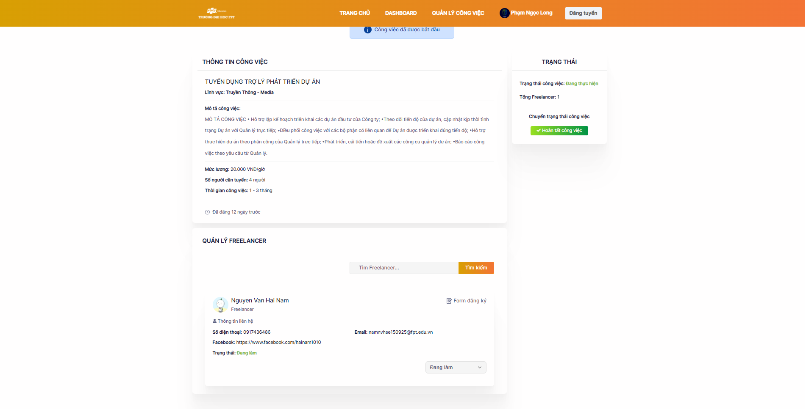

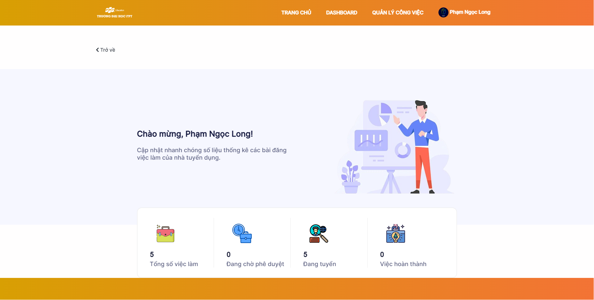

